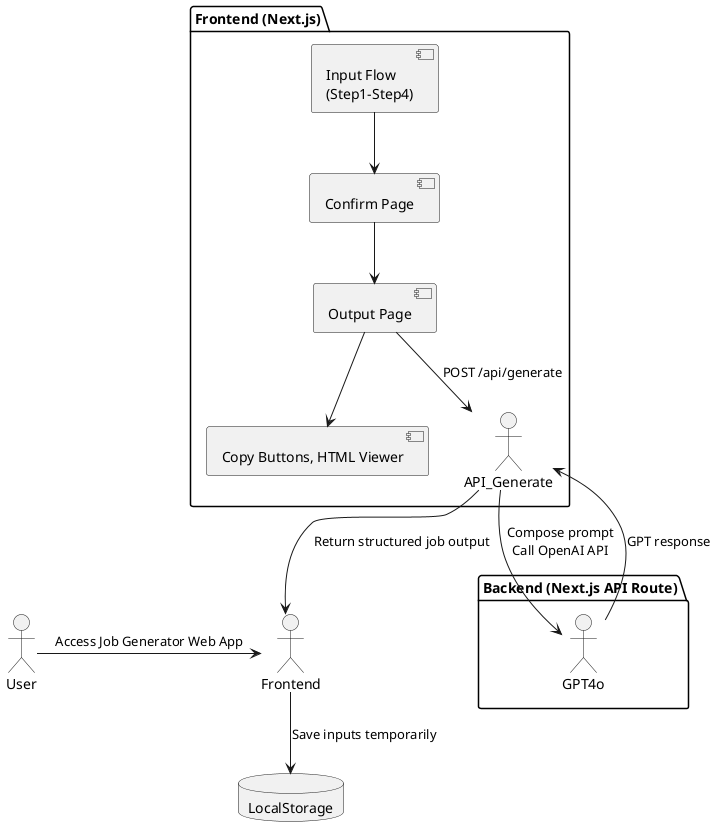

## 1. Background

# Background

The Job Post Generator is a Japanese-language web-based tool designed for HR staff at small to mid-sized companies in Japan. These users typically struggle to write effective job listings. The tool provides a guided, step-by-step form to collect job information and leverages GPT-4o to output clean, well-formatted job posts tailored for internal use or publishing on job platforms like Indeed. It aims to automate structured job post creation without requiring user login, databases, or long-term persistence at the MVP stage.

---

## 2. Requirements

## Requirements

Requirements are prioritized using the MoSCoW method:

### ✅ Must Have
- [M1] Guided 4-step form UI with 12 questions (Q1–Q12)
- [M2] Client-side validation as defined per question spec
- [M3] Two GPT output modes:
  - [M3.1] Internal/company site format (structured text)
  - [M3.2] Indeed format (HTML-compliant, NG-word filtering, structure rules)
- [M4] GPT output sections:
  - Job Title
  - Field values (for platform entry)
  - Job Description Body (HTML)
- [M5] Frontend: Built with Next.js and shadcn/ui
- [M6] Backend: GPT-4o integration via OpenAI API, called via /api/generate
- [M7] Input/output transitions via SPA-style page flow
- [M8] Client-side logging of free-text fields for future UX improvement

### ✅ Should Have
- [S1] Retry mechanism and error display for GPT call failures
- [S2] Dynamic document title using job title
- [S3] Output screen with code/plain toggle and copy buttons
- [S4] Local persistence of input across steps (localStorage or React context)

### ✅ Could Have (For Extensibility)
- [C1] Database and auth support for saved job drafts
- [C2] Media-specific prompt switching (e.g., future platforms)
- [C3] PDF/Excel/CSV export formats (non-MVP)
- [C4] UI for switching writing style presets (casual/formal/etc.)

### ✅ Won’t Have (In MVP)
- [W1] User login, database, or Supabase backend
- [W2] Job post history, save, or Mypage functionality
- [W3] SEO optimization or mobile-first responsiveness


---

## 3. Method: System Architecture

## Method

### System Architecture Overview



### Component Responsibilities

#### 1. Frontend (Next.js + shadcn/ui)

**Input Flow (Step1–4):**

- 12 questions displayed across 4 SPA-style pages
- Inputs stored in React context and localStorage

**Confirm Page:**

- Aggregated preview of entered data before generation

**Output Page:**

- Shows:
  - Generated Job Title
  - Field-by-field copy interface
  - HTML-formatted job body (toggle/code view)
- Retry GPT generation on failure

#### 2. Backend API Route (`/api/generate`)

- Composes GPT prompt using a template
- Applies platform-specific rules (e.g., HTML tags, NG word removal, structure)
- Uses OpenAI SDK to call GPT-4o with user inputs
- Returns parsed response back to the frontend

#### 3. Local Storage

- Input state cached to allow navigation across steps and prevent data loss
- No long-term persistence or user identification


---

## 3.1 Directory Structure

## Next.js Directory and File Structure

```
/jobpost-generator
├── app/
│   ├── page.tsx                  # Intro screen with "Start" CTA
│   ├── step/
│   │   ├── [stepId]/page.tsx     # Step1–Step4 dynamic form pages
│   ├── confirm/page.tsx          # Confirm screen
│   ├── result/page.tsx           # GPT output screen
│   └── layout.tsx                # App shell (shared layout)
│
├── components/
│   ├── FormStep.tsx              # Renders each question set (Step1–4)
│   ├── ConfirmSummary.tsx        # Summary before generation
│   ├── OutputSection.tsx         # Job Title + Fields + HTML Display
│   ├── ToggleableHtml.tsx        # HTML viewer with code/plain toggle
│   ├── CopyButton.tsx            # Copy to clipboard
│   └── ErrorDisplay.tsx          # GPT failure/retry UI
│
├── lib/
│   ├── promptBuilder.ts          # GPT prompt templates and generator
│   ├── validators.ts             # Field-level validation rules
│   └── types.ts                  # TypeScript types for Q1–Q12, outputs
│
├── context/
│   └── FormContext.tsx           # React context to hold all form inputs
│
├── public/                       # Icons, fonts, etc.
├── styles/                       # Tailwind / global CSS
├── pages/
│   └── api/
│       └── generate.ts           # POST /api/generate → GPT-4o call
│
├── .env.local                    # OPENAI_API_KEY etc.
├── next.config.js
└── tsconfig.json
```

### Notes:
- Pages under `/step/[stepId]` use dynamic routing for Step1–Step4
- `FormContext.tsx` provides shared state across steps and output
- `promptBuilder.ts` centralizes prompt logic (switching formats by Q11)
- Clean separation between:
  - Form state
  - GPT integration
  - UI display logic


---

## 3.2 State Management

## State Management Plan

### 🧠 Architecture: Dual Approach
Use **React Context** for real-time step-to-step state, and **localStorage** for persistence across reloads or tab recovery.

---

### 1. React Context (`FormContext.tsx`)
- Holds current values of all 12 inputs (Q1–Q12)
- Provides `getValues()`, `setValue(qKey, value)` helpers
- Wraps the entire app in `_app.tsx` or `layout.tsx`

Example:
```ts
const { values, setValue } = useFormContext()
setValue("q4", ["..."]) // Store bullet-point job content
```

---

### 2. LocalStorage Sync (`usePersistedForm` hook)
- Mirrors form state into localStorage under key `jobgen.form`
- Restores values on page refresh or re-entry
- Uses debounce on save to avoid excessive writes

Example:
```ts
useEffect(() => {
  localStorage.setItem("jobgen.form", JSON.stringify(values))
}, [values])
```

---

### 3. Output State
- Output result (`jobTitle`, `fields`, `htmlBody`) stored in local state on result page
- No need for long-term storage; users copy outputs manually
- Optional: allow “Regenerate” using stored `FormContext` values

---

### Benefits
- No backend dependency
- Smooth user experience across step transitions
- Easy migration path to DB-based storage in future (e.g., Supabase)


---

## 3.3 Validation Strategy

## Validation Strategy

### ⚙️ Scope
- Lightweight, client-side only
- Rule-based per-question validation
- Prevent user from progressing with incomplete required fields

---

### Approach

#### 1. Centralized Rule Engine (`validators.ts`)
Each question (Q1–Q12) has:
- Required flag
- Type guard (e.g., string, array, enum)
- Custom rules (e.g., Q4–Q5 must have 3–5 items)

Example:
```ts
const validators = {
  q1: (val) => typeof val === "string" && val.length > 0,
  q4: (val) => Array.isArray(val) && val.length >= 3 && val.length <= 5,
  q9: (val) => val.min > 0 && val.max >= val.min,
}
```

#### 2. Step-Level Validation
- On "Next" click at each step, validate all questions on that step
- If invalid:
  - Show inline error message (shadcn `FormMessage`)
  - Prevent navigation

#### 3. Confirm Page Validation
- Full revalidation of all fields before allowing submission
- Disables "Generate" button if any field fails

---

### UX Details
- Free-text fields show placeholder/example + optional character count
- Multi-select: Enforce at least one selection where required
- Time inputs: Use controlled format inputs (e.g., “9:00–18:00”)

---

### Error Message Strategy
- Simple, natural Japanese copy like:
  - 入力は必須です (“Input is required”)
  - 3〜5項目を入力してください (“Enter 3–5 items”)


---


---

## 3.3.1 UI Question & Validation Configuration

### Japanese Question Metadata (lib/questions.ts)

All 12 questions (Q1–Q12) are defined in `lib/questions.ts` with the following structure:

```ts
[
  {
    id: "q1",
    label: "どのような職種を募集したいですか？",
    placeholder: "例：シニアソフトウエアエンジニア、フィールドセールスなど",
    supplement: "具体的な役職名や職務タイトルを入力してください。"
  },
  {
    id: "q2",
    label: "そのポジションにどんな役割を期待していますか？",
    placeholder: "例：事業の立ち上げ〜グロースの責任者",
    supplement: "いま社内でどんな役割が不足していて、その人に何を担って欲しいかを書いてください。"
  },
  {
    id: "q3",
    label: "今回の募集に至った背景を教えてください",
    placeholder: "例：新規事業の開始に伴い、○○の専任担当が必要になったため",
    supplement: "人員補充、新しい挑戦など、採用に至るまでのストーリーがあると親切です。"
  },
  {
    id: "q4",
    label: "具体的にどんな業務をお願いする予定ですか？",
    placeholder: "例：見込み顧客への初回商談・提案資料の作成・契約交渉 など",
    supplement: "箇条書きで3〜5個程度が読みやすく、実態も伝わりやすくなります。"
  },
  {
    id: "q5",
    label: "その業務に必要なスキルや経験があれば教えてください",
    placeholder: "例：無形商材の法人営業経験、SaaS営業の経験 など",
    supplement: "箇条書きで3〜5個程度、現場の目線で書くのがおすすめです。"
  },
  {
    id: "q6",
    label: "どんな人がこの仕事に向いていそうですか？",
    placeholder: "例：現場での試行錯誤が好きな方、決まった正解がない状況を楽しめる方 など",
    supplement: "選択肢から選んだあとに、さらに自由記述で補足ができます。"
  },
  {
    id: "q7",
    label: "雇用形態について教えてください",
    placeholder: "例：正社員／契約社員／業務委託など",
    supplement: "複数選択可。検討中でも構いません。"
  },
  {
    id: "q8",
    label: "勤務時間や休日について教えてください",
    placeholder: "例：フレックスタイム制（コアタイム11〜15時）、完全週休二日制（土日祝）",
    supplement: "選択肢＋自由記述。働き方に特徴がある場合はぜひ記載を。"
  },
  {
    id: "q9",
    label: "想定している給与レンジがあれば教えてください",
    placeholder: "例：月給30〜40万円／年収500〜700万円 など",
    supplement: "形式（年収／月給）を選んで、金額レンジと補足を入力できます。"
  },
  {
    id: "q10",
    label: "その他、福利厚生や制度などで伝えておきたいことがあれば",
    placeholder: "例：書籍購入制度・勉強会参加支援など",
    supplement: "選択肢から選んだあとに、自由記述で補足できます。"
  },
  {
    id: "q11",
    label: "どの媒体向けに出力しますか？",
    placeholder: "例：自社サイト／Indeed",
    supplement: "文体や構成が切り替わります。"
  },
  {
    id: "q12",
    label: "文体の希望があれば教えてください（任意）",
    placeholder: "例：丁寧め／やわらかめ／若者向け／固め など",
    supplement: "明確な指定がない場合、媒体に応じたデフォルト文体が使われます。"
  }
]
```
- Location: `lib/questions.ts`
- Each question contains `id`, `label`, `placeholder`, and `supplement`
- Used in Step1–4 form flows for dynamic rendering
- Prepares the app for i18n expansion and easy UI copy management
---

### Error Messages Plan (lib/errorMessages.ts)
This module defines per-field validation messages, keyed by question ID.

```ts
export const errorMessages = {
  q1: "この項目は必須です",
  q2: "この項目は必須です",
  q3: "この項目は必須です",
  q4: "3〜5個の業務内容を入力してください",
  q5: "3〜5個のスキルを入力してください",
  q6: "少なくとも1つ選択してください",
  q7: "少なくとも1つ選択してください",
  q8: "少なくとも1つ選択してください",
  q9: "最小金額を入力し、最大金額は最小以上にしてください",
  q10: "少なくとも1つ選択してください",
  q11: "出力媒体を選択してください",
  q12: "文体の指定が不正です"
};
```

- Location: `lib/errorMessages.ts`
- Used by `validators.ts` and displayed via shadcn `<FormMessage />`
- Maintains consistent UX and Japanese error tone
- Easily updatable and localizable in the future

---

### Localization & Extensibility Notes

- All UI labels and messages are centralized to allow future translation or customization.
- Future alternate language support (e.g., English UI) can override `questions.ts` and `errorMessages.ts`.
- GPT prompt templates are not localized—only the UI layer is.


## 3.4 API & GPT Integration

## API Design Specs

### Endpoint
```
POST /api/generate
```

### Purpose
Receives all 12 inputs (Q1–Q12), generates a platform-specific prompt, sends it to GPT-4o, and returns structured output for display.

---

### Request Payload
```ts
type GenerationRequest = {
  q1: string;               // Job Title
  q2: string;               // Expected Role
  q3: string;               // Hiring Background
  q4: string[];             // Job Tasks (bullets)
  q5: string[];             // Skills/Experience (bullets)
  q6: { tags: string[], note?: string };  // Suitable Traits
  q7: string[];             // Employment Types
  q8: { options: string[], note?: string }; // Working Time & Holidays
  q9: { type: "月給" | "年収", min: number, max: number, notes?: string };
  q10: { tags: string[], note?: string };  // Benefits
  q11: "internal" | "indeed"; // Output Mode
  q12?: string;              // Tone override (optional)
}
```

### Response Payload
```ts
type GenerationResponse = {
  jobTitle: string; // Attention-optimized job title
  fields: { label: string; value: string }[]; // For copy-paste field use
  htmlBody: string; // HTML-formatted description for output
}
```

---

### GPT Integration Flow
1. `promptBuilder.ts` uses `q11` and `q12` to select the correct prompt template.
2. Template placeholders are replaced with structured inputs.
3. GPT is called via OpenAI SDK (`openai.chat.completions.create`).
4. Response is parsed into:
   - `jobTitle`: Headline string
   - `fields`: Name/value pairs from inputs
   - `htmlBody`: Fully formatted job body (`<h2>` + `<div>` blocks or plain text)

### GPT Error Handling
| Case                        | Behavior                         |
|-----------------------------|----------------------------------|
| GPT timeout / API error     | Return 500 + `{ error: string }` |
| Unexpected response format  | Return fallback string + log it  |
| HTML malformed (Indeed)     | Show warning, allow retry        |

---

### Frontend Error UI
- `<ErrorDisplay />` component shows:
  - GPT error message
  - Retry button (calls same input again)
  - Optional: Regenerate with modified prompt


## GPT Call Logic + Error Handling

### 🔁 Overview
The backend `/api/generate` handles GPT-4o calls with robust parsing and fallback logic.

---

### 1. Prompt Generation
Uses `promptBuilder.ts` to:
- Select template based on `q11` (output mode)
- Adjust tone if `q12` is specified
- Sanitize values (e.g., escape brackets or quotes)

```ts
const prompt = buildPrompt(userInputs)
```

---

### 2. API Call (OpenAI SDK)
Uses `chat.completions.create()` with:
- `model: 'gpt-4o'`
- `temperature: 0.7`
- `max_tokens: 2048`
- `messages: [{ role: 'user', content: prompt }]`

```ts
const completion = await openai.chat.completions.create({ ... })
```

---

### 3. Response Handling
Parses text into:
- `jobTitle` (first line or GPT-labeled)
- `fields` (derived from Q1–Q10 input values)
- `htmlBody` (validated for `<h2>` and `<div>` only if Indeed mode)

#### Error Scenarios:
| Case                        | Behavior                         |
|-----------------------------|----------------------------------|
| GPT timeout / API error     | Return 500 + `{ error: string }` |
| Unexpected response format  | Return fallback string + log it  |
| HTML malformed (Indeed)     | Show warning, allow retry        |

---

### 4. Frontend Error UI
`<ErrorDisplay />` component shows:
- GPT error message
- Retry button (calls same input again)
- Optional: Regenerate with modified prompt


---

## 3.5 Extensibility Plan

## Extensibility & Structural Decisions

### 🧱 1. Prompt Builder as Pluggable Module
`promptBuilder.ts` structured as:
```ts
buildPrompt(input: GenerationRequest): string
```
**Future expansion:**
- `promptBuilder/internal.ts`
- `promptBuilder/indeed.ts`
- `promptBuilder/other.ts`

➡ Enables easy media-specific tuning without touching API logic.

---

### 📃 2. Database-Ready Input Structure
`GenerationRequest` maps cleanly to a future DB schema:
- One row per generated job
- JSONB field for Q1–Q12
- Indexed on company/user if auth added

➡ Supabase or Postgres can be plugged in with minimal migration.

---

### 🔐 3. Auth & Mypage Hooks
App layout and API routes are isolated cleanly:
- Can wrap layout in `AuthProvider` later
- `/api/generate` can be protected via middleware (`/api/secure/generate`)

➡ Paves the way for login + saved history (`/mypage`).

---

### 📄 4. Multi-Output Pipeline (PDF, Excel, CSV)
Structure output as:
```ts
{
  title: string,
  fields: Field[],
  body: string (HTML),
}
```
**Use it to generate:**
- HTML preview (current MVP)
- PDF export via Puppeteer
- Excel/CSV via serverless packages

➡ Prepares the system for cross-channel publishing.


---

## 4. Implementation

## Implementation

### Phase 1: Project Setup & Scaffolding

- Initialize Next.js project with `app/` directory structure
- Install dependencies:
  - `shadcn/ui`, `tailwindcss`, `zod` (for future validation), `openai`
- Configure `next.config.js`, Tailwind, and environment variables (`.env.local` with `OPENAI_API_KEY`)
- Add base layout and page routing for:
  - `step/[stepId]`, `confirm`, `result`

---

### Phase 2: Form Flow (Input Steps)

- Create `FormContext.tsx` to manage Q1–Q12 state
- Build `FormStep.tsx` and route it dynamically via `[stepId]`
- Implement localStorage persistence with `usePersistedForm()`
- Add inline validation and visual hints (example templates, placeholder logic)
- Style with shadcn/ui components (e.g. `Form`, `Input`, `Checkbox`, etc.)

---

### Phase 3: Confirm & GPT Integration

- Build `ConfirmSummary.tsx` to preview all 12 inputs
- Create `POST /api/generate` handler
- Implement `promptBuilder.ts` for both internal and Indeed output formats
- Handle GPT API call using OpenAI SDK
- Parse and sanitize response (`jobTitle`, `fields`, `htmlBody`)

---

### Phase 4: Output Display

- Build `OutputSection.tsx` to show:
  - Title (copyable)
  - Field list (label + value + copy)
  - HTML viewer (`ToggleableHtml.tsx`)
- Add `ErrorDisplay.tsx` for retries and GPT errors
- Optional: support regeneration from cached input

---

### Phase 5: QA & Polish

- Validate all transitions and data persistence
- Confirm formatting rules match Indeed’s guide
- Japanese UX copy proofreading (placeholders, errors, buttons)
- Add accessibility for form fields and buttons
- Test fallback logic (bad GPT response, network errors)


---

## 5. Milestones

## Milestones

| Phase                     | Milestone Description                              | Owner     | Target Date |
|--------------------------|-----------------------------------------------------|-----------|-------------|
| 🛠️ Project Bootstrap       | Repo setup, Next.js scaffold, shadcn/ui configured | Dev Team  | Day 1       |
| 🔢 Input UI Steps         | Step1–Step4 flow, validations, localStorage wiring | Dev Team  | Day 3       |
| ✅ Confirm Page           | Preview inputs, button to trigger GPT              | Dev Team  | Day 4       |
| 🔮 GPT Integration        | `/api/generate`, prompt templates, error handling  | Dev Team  | Day 6       |
| 📄 Output UI              | Copy buttons, HTML viewer, retry mechanism         | Dev Team  | Day 7       |
| 🧪 QA & Testing           | UX polish, validation, GPT retry/fallback checks   | QA        | Day 9       |
| 🚀 MVP Launch             | Deployed to Vercel with review from stakeholders   | PM + Dev  | Day 10      |


---

## 6. Gathering Results

## Gathering Results

### 🌟 Post-Launch Evaluation Plan

#### 1. Requirement Coverage Review
- ✅ All “Must Have” items ([M1]–[M8]) implemented and tested
- ⟳ “Should Have” items validated manually (e.g., retry flow, copy buttons)
- ❌ “Won’t Have” items explicitly omitted and deferred to future versions

---

#### 2. Performance Checks
- Ensure GPT-4o responses are returned in under 5 seconds for 95% of requests
- Confirm HTML output passes basic structure checks (`<h2>`, `<div>`)
- Test localStorage persistence and restore across tab reloads

---

#### 3. UX Feedback Collection
- Conduct usability testing with 3–5 non-technical HR users
- Ask for feedback on:
  - Ease of form navigation
  - Quality and clarity of generated output
  - Trustworthiness and professional tone of results

---

#### 4. Improvement Logging
- Collect anonymized free-text from Q2, Q3, Q4, etc., for prompt fine-tuning
- Log GPT error types/frequency for tuning retries and user messaging

---

#### 5. Next Steps
- Decide on timing to enable:
  - Save/login flow (Supabase or auth provider)
  - Mypage with saved drafts
  - Media-specific extensions (LinkedIn, Green, etc.)
  - Export to PDF, CSV

