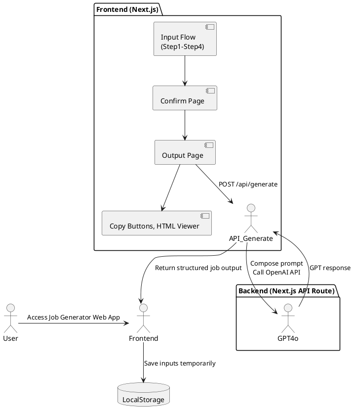

## 1. Background

# Background

The Job Post Generator is a Japanese-language web-based tool designed for HR staff at small to mid-sized companies in Japan. These users typically struggle to write effective job listings. The tool provides a guided, step-by-step form to collect job information and leverages GPT-4o to output clean, well-formatted job posts tailored for internal use or publishing on job platforms like Indeed. It aims to automate structured job post creation without requiring user login, databases, or long-term persistence at the MVP stage.

---

## 2. Requirements

## Requirements

Requirements are prioritized using the MoSCoW method:

### ✅ Must Have
- [M1] Guided 4-step form UI with 12 questions (Q1–Q12)
- [M2] Client-side validation as defined per question spec
- [M3] Two GPT output modes:
  - [M3.1] Internal/company site format (structured text)
  - [M3.2] Indeed format (HTML-compliant, NG-word filtering, structure rules)
- [M4] GPT output sections:
  - Job Title
  - Field values (for platform entry)
  - Job Description Body (HTML)
- [M5] Frontend: Built with Next.js and shadcn/ui
- [M6] Backend: GPT-4o integration via OpenAI API, called via /api/generate
- [M7] Input/output transitions via SPA-style page flow
- [M8] Client-side logging of free-text fields for future UX improvement

### ✅ Should Have
- [S1] Retry mechanism and error display for GPT call failures
- [S2] Dynamic document title using job title
- [S3] Output screen with code/plain toggle and copy buttons
- [S4] Local persistence of input across steps (localStorage or React context)

### ✅ Could Have (For Extensibility)
- [C1] Database and auth support for saved job drafts
- [C2] Media-specific prompt switching (e.g., future platforms)
- [C3] PDF/Excel/CSV export formats (non-MVP)
- [C4] UI for switching writing style presets (casual/formal/etc.)

### ✅ Won’t Have (In MVP)
- [W1] User login, database, or Supabase backend
- [W2] Job post history, save, or Mypage functionality
- [W3] SEO optimization or mobile-first responsiveness


---

## 3. Method: System Architecture

## 3.0  Method

### System Architecture Overview



### Component Responsibilities

#### 1. Frontend (Next.js + shadcn/ui)

**Input Flow (Step1–4):**

- 12 questions displayed across 4 SPA-style pages
- Inputs stored in React context and localStorage

**Confirm Page:**

- Aggregated preview of entered data before generation

**Output Page:**

- Shows:
  - Generated Job Title
  - Field-by-field copy interface
  - HTML-formatted job body (toggle/code view)
- Retry GPT generation on failure

#### 2. Backend API Route (`/api/generate`)

- Composes GPT prompt using a template
- Applies platform-specific rules (e.g., HTML tags, NG word removal, structure)
- Uses OpenAI SDK to call GPT-4o with user inputs
- Returns parsed response back to the frontend

#### 3. Local Storage

- Input state cached to allow navigation across steps and prevent data loss
- No long-term persistence or user identification


---
## 3.1 Step Flow Definition

The job form consists of 4 sequential steps, each containing a specific set of structured questions (Q1–Q12). Users complete the form by progressing through each step in order.

| Step    | Question ID(s) | Topic Coverage                           |
|---------|----------------|-------------------------------------------|
| Step 1  | Q1–Q3           | Job Title, Expected Role, Background     |
| Step 2  | Q4–Q6           | Responsibilities, Skills, Candidate Fit  |
| Step 3  | Q7–Q10          | Employment Type, Work Style, Salary, Benefits |
| Step 4  | Q11–Q12         | Output Channel, Preferred Writing Style  |

Each question contains metadata such as:

- `label` (the visible prompt)
- `placeholder` (example input)
- `guidance` (supplemental instructions for the user)
- `choices` (for radio/checkbox fields)

The structure supports progressive disclosure, schema-based validation, and future integration with multilingual UI or template generation.


---

## 3.2 Directory Structure

## Next.js Directory and File Structure

The project structure is modular and organized by function, facilitating clarity, reusability, and scalability for a multi-step form-based application.
All paths below are relative to the project root /jobpost-generator/

```
src/
├── app/                            # Next.js App Router entry
│   ├── layout.tsx                  # Root layout for the app
│   ├── step/                       # Step-by-step form pages
│   │   ├── [stepId]/              # Dynamic route for each step (step1, step2, ...)
│   │       └── page.tsx           # Page renderer with context/form integration
│   ├── confirm/page.tsx          # Confirm screen
│   ├── result/page.tsx           # GPT output screen
│   ├── layout.tsx                # App shell (shared layout)
│   └── api/
│       └── generate/
│           └── route.ts          # POST /api/generate → GPT-4o integration (App Router)
│
├── components/
│   ├── ui/                  　    # Base UI components generated by shadcn/ui (button, input, etc.)
│   │   ├── button.tsx
│   │   ├── input.tsx
│   │   └── ...
│
│   ├── forms/                      # Higher-level components tied to job form logic
│   │   ├── FormStep.tsx            # Renders all questions in a step
│   │   ├── QuestionItem.tsx        # Renders a single question dynamically
│   │   └── NavigationButtons.tsx   # "Back"/"Next" buttons per step
│
│   ├── OutputSection.tsx       # GPT output viewer (title + HTML + fields)
│   ├── ConfirmSummary.tsx      # Input preview before submission
│   └── ErrorDisplay.tsx        # GPT API error UI
│
│
├── constants/                     # Static configuration and metadata
│   └── jobFormQuestions/          # Step-based question definitions
│       ├── jobFormQuestionsStep1.ts
│       ├── jobFormQuestionsStep2.ts
│       ├── jobFormQuestionsStep3.ts
│       ├── jobFormQuestionsStep4.ts
│
├── context/
│   └── FormContext.tsx            # Centralized form state context
│
├── types/
│   ├── questionTypes.ts           # Schema definition (discriminated unions)
│   ├── formTypes.ts               # Step-level and final output types
│   └── apiTypes.ts               # Request/response types for OpenAI API
│
├── utils/
│   ├── validators/                # Step-level validation functions
│   │   ├── validators_step_1.ts
│   │   ├── validators_step_2.ts
│   │   ├── validators_step_3.ts
│   │   └── validators_step_4.ts
│   ├── helpers.ts                 # General-purpose utilities
│   └── promptBuilder.ts          # Prompt templates for GPT generation (internal/indeed formats)
│
├── __tests__/                     # Jest test cases
│   ├── validators_step_1.test.ts
│   ├── validators_step_2.test.ts
│   ├── validators_step_3.test.ts
│   └── validators_step_4.test.ts
│
├── public/                       # Icons, fonts, etc.
├── styles/                       # Tailwind / global CSS
│
├── docs/                         # Project documentation and specifications
│   └── SPEC-01-JobPostGenerator.md
│
├── lib/
│   └── utils.ts                   # Utility function for cn() using clsx + tailwind-merge (required by shadcn)
│
├── .gitignore                    # Git exclusion rules
├── LICENSE                       # License file (optional)
├── README.md                     # (Recommended) Project overview
├── package.json                  # NPM package definitions
├── package-lock.json             # Dependency lock file
├── .env.local                    # OPENAI_API_KEY etc.
├── next.config.js                # Next.js configuration
└── tsconfig.json                 # TypeScript configuration
```

### Notes:

- Pages under `/step/[stepId]/page.tsx` handle the multi-step flow (Step1–Step4) via dynamic routing.
- `FormContext.tsx` manages form state across steps and final confirmation/output.
- `promptBuilder.ts` encapsulates prompt formatting logic, adapting output according to Q11 (media format).
- Clear separation is maintained between:
  - Form state management (`FormContext.tsx`)
  - Validation rules (`validators_step_X.ts`)
  - GPT prompt generation (`promptBuilder.ts`)
  - UI rendering (`step/[stepId]/page.tsx`, `components/`, etc.)


---

## 3.3 State Management

## State Management Plan

### 🧠 Architecture: Dual Approach
Use **React Context** for real-time step-to-step state, and **localStorage** for persistence across reloads or tab recovery.

---

### 1. React Context (`FormContext.tsx`)
- Holds current values of all 12 inputs (Q1–Q12)
- Provides `getValues()`, `setValue(qKey, value)` helpers
- Wraps the entire app in `_app.tsx` or `layout.tsx`

Example:
```ts
const { values, setValue } = useFormContext()
setValue("q4", ["..."]) // Store bullet-point job content
```

---

### 2. LocalStorage Sync (`usePersistedForm` hook)
- Mirrors form state into localStorage under key `jobgen.form`
- Restores values on page refresh or re-entry
- Uses debounce on save to avoid excessive writes

Example:
```ts
useEffect(() => {
  localStorage.setItem("jobgen.form", JSON.stringify(values))
}, [values])
```

---

### 3. Output State
- Output result (`jobTitle`, `fields`, `htmlBody`) stored in local state on result page
- No need for long-term storage; users copy outputs manually
- Optional: allow “Regenerate” using stored `FormContext` values

---

### Benefits
- No backend dependency
- Smooth user experience across step transitions
- Easy migration path to DB-based storage in future (e.g., Supabase)


---

## 3.4 Validation Strategy

### ⚙️ Scope
- Lightweight, client-side only
- Rule-based per-question validation
- Prevent user from progressing with incomplete required fields

### Validation Architecture  
Each question has a dedicated validator function (e.g., `validateQ1` to `validateQ12`), defined in `validators_step_X.ts` files.  
Each validator follows the signature: `(value: any) => true | string`  
Functions are named clearly for Copilot and human readability.


---

## 3.4.1 Error

### 1. Error Message Handling  
Error messages are currently defined inline within validator functions (can be externalized later).  
Each message **should be associated with an error code or identifier**, to support logging and traceability.

If assigning explicit error codes is difficult, fallback strategies like including function name, file name, or line reference in the logs are acceptable.

### 2. Error Message Strategy
- Simple, natural Japanese copy like:
  - 入力は必須です (“Input is required”)
  - 3〜5項目を入力してください (“Enter 3–5 items”)


---

## 3.4.2 Validation

#### Validation Style by Input Type  
- `text`: Non-empty string check  
- `checkbox`: Minimum selection enforcement  
- `bulletList`: Must include line breaks and respect item limits  
- `range`: Validate all subfields (e.g., min, max, unit for salary)

#### Step-wise Validation  
Only the current step's questions are validated on `onNext()`  
On failure: show `<FormMessage />` and block navigation

####  Final Validation
All questions are revalidated on the Confirm screen  
If any error exists, the "Generate GPT Output" button is disabled

---

### UX Details
- Free-text fields show placeholder/example + optional character count
- Multi-select: Enforce at least one selection where required
- Time inputs: Use controlled format inputs (e.g., “9:00–18:00”)


---

## 3.5 API & GPT Integration

## API Design Specs

### Endpoint
```
POST /api/generate
```

### Purpose
Receives all 12 inputs (Q1–Q12), generates a platform-specific prompt, sends it to GPT-4o, and returns structured output for display.

---

### Request Payload
```ts
type GenerationRequest = {
  q1: string;               // Job Title
  q2: string;               // Expected Role
  q3: string;               // Hiring Background
  q4: string[];             // Job Tasks (bullets)
  q5: string[];             // Skills/Experience (bullets)
  q6: { tags: string[], note?: string };  // Suitable Traits
  q7: string[];             // Employment Types
  q8: { options: string[], note?: string }; // Working Time & Holidays
  q9: { type: "月給" | "年収", min: number, max: number, notes?: string };
  q10: { tags: string[], note?: string };  // Benefits
  q11: "internal" | "indeed"; // Output Mode
  q12?: string;              // Tone override (optional)
}
```

### Response Payload
```ts
type GenerationResponse = {
  jobTitle: string; // Attention-optimized job title
  fields: { label: string; value: string }[]; // For copy-paste field use
  htmlBody: string; // HTML-formatted description for output
}
```

---

### GPT Integration Flow
1. `promptBuilder.ts` uses `q11` and `q12` to select the correct prompt template.
2. Template placeholders are replaced with structured inputs.
3. GPT is called via OpenAI SDK (`openai.chat.completions.create`).
4. Response is parsed into:
   - `jobTitle`: Headline string
   - `fields`: Name/value pairs from inputs
   - `htmlBody`: Fully formatted job body (`<h2>` + `<div>` blocks or plain text)

### GPT Error Handling
| Case                        | Behavior                         |
|-----------------------------|----------------------------------|
| GPT timeout / API error     | Return 500 + `{ error: string }` |
| Unexpected response format  | Return fallback string + log it  |
| HTML malformed (Indeed)     | Show warning, allow retry        |

---

### Frontend Error UI
- `<ErrorDisplay />` component shows:
  - GPT error message
  - Retry button (calls same input again)
  - Optional: Regenerate with modified prompt


## GPT Call Logic + Error Handling

### 🔁 Overview
The backend `/api/generate` handles GPT-4o calls with robust parsing and fallback logic.

---

### 1. Prompt Generation
Uses `promptBuilder.ts` to:
- Select template based on `q11` (output mode)
- Adjust tone if `q12` is specified
- Sanitize values (e.g., escape brackets or quotes)

```ts
const prompt = buildPrompt(userInputs)
```

---

### 2. API Call (OpenAI SDK)
Uses `chat.completions.create()` with:
- `model: 'gpt-4o'`
- `temperature: 0.7`
- `max_tokens: 2048`
- `messages: [{ role: 'user', content: prompt }]`

```ts
const completion = await openai.chat.completions.create({ ... })
```

---

### 3. Response Handling
Parses text into:
- `jobTitle` (first line or GPT-labeled)
- `fields` (derived from Q1–Q10 input values)
- `htmlBody` (validated for `<h2>` and `<div>` only if Indeed mode)

#### Error Scenarios:
| Case                        | Behavior                         |
|-----------------------------|----------------------------------|
| GPT timeout / API error     | Return 500 + `{ error: string }` |
| Unexpected response format  | Return fallback string + log it  |
| HTML malformed (Indeed)     | Show warning, allow retry        |

---

### 4. Frontend Error UI
`<ErrorDisplay />` component shows:
- GPT error message
- Retry button (calls same input again)
- Optional: Regenerate with modified prompt


---

## 3.6 Extensibility Plan

## Extensibility & Structural Decisions

### 🧱 1. Prompt Builder as Pluggable Module
`promptBuilder.ts` structured as:
```ts
buildPrompt(input: GenerationRequest): string
```
**Future expansion:**
- `promptBuilder/internal.ts`
- `promptBuilder/indeed.ts`
- `promptBuilder/other.ts`

➡ Enables easy media-specific tuning without touching API logic.

---

### 📃 2. Database-Ready Input Structure
`GenerationRequest` maps cleanly to a future DB schema:
- One row per generated job
- JSONB field for Q1–Q12
- Indexed on company/user if auth added

➡ Supabase or Postgres can be plugged in with minimal migration.

---

### 🔐 3. Auth & Mypage Hooks
App layout and API routes are isolated cleanly:
- Can wrap layout in `AuthProvider` later
- `/api/generate` can be protected via middleware (`/api/secure/generate`)

➡ Paves the way for login + saved history (`/mypage`).

---

### 📄 4. Multi-Output Pipeline (PDF, Excel, CSV)
Structure output as:
```ts
{
  title: string,
  fields: Field[],
  body: string (HTML),
}
```
**Use it to generate:**
- HTML preview (current MVP)
- PDF export via Puppeteer
- Excel/CSV via serverless packages

➡ Prepares the system for cross-channel publishing.


---

## 4. Implementation

## Implementation

### Phase 1: Project Setup & Scaffolding

- Initialize Next.js project with `app/` directory structure
- Install dependencies:
  - `shadcn/ui`, `tailwindcss`, `zod` (for future validation), `openai`
- Configure `next.config.js`, Tailwind, and environment variables (`.env.local` with `OPENAI_API_KEY`)
- Add base layout and page routing for:
  - `step/[stepId]`, `confirm`, `result`

---

### Phase 2: Form Flow (Input Steps)

- Create `FormContext.tsx` to manage Q1–Q12 state
- Build `FormStep.tsx` and route it dynamically via `[stepId]`
- Implement localStorage persistence with `usePersistedForm()`
- Add inline validation and visual hints (example templates, placeholder logic)
- Style with shadcn/ui components (e.g. `Form`, `Input`, `Checkbox`, etc.)

---

### Phase 3: Confirm & GPT Integration

- Build `ConfirmSummary.tsx` to preview all 12 inputs
- Create `POST /api/generate` handler
- Implement `promptBuilder.ts` for both internal and Indeed output formats
- Handle GPT API call using OpenAI SDK
- Parse and sanitize response (`jobTitle`, `fields`, `htmlBody`)

---

### Phase 4: Output Display

- Build `OutputSection.tsx` to show:
  - Title (copyable)
  - Field list (label + value + copy)
  - HTML viewer (`ToggleableHtml.tsx`)
- Add `ErrorDisplay.tsx` for retries and GPT errors
- Optional: support regeneration from cached input

---

### Phase 5: QA & Polish

- Validate all transitions and data persistence
- Confirm formatting rules match Indeed’s guide
- Japanese UX copy proofreading (placeholders, errors, buttons)
- Add accessibility for form fields and buttons
- Test fallback logic (bad GPT response, network errors)


---

## 5. Milestones

## Milestones

| Phase                     | Milestone Description                              | Owner     | Target Date |
|--------------------------|-----------------------------------------------------|-----------|-------------|
| 🛠️ Project Bootstrap       | Repo setup, Next.js scaffold, shadcn/ui configured | Dev Team  | Day 1       |
| 🔢 Input UI Steps         | Step1–Step4 flow, validations, localStorage wiring | Dev Team  | Day 3       |
| ✅ Confirm Page           | Preview inputs, button to trigger GPT              | Dev Team  | Day 4       |
| 🔮 GPT Integration        | `/api/generate`, prompt templates, error handling  | Dev Team  | Day 6       |
| 📄 Output UI              | Copy buttons, HTML viewer, retry mechanism         | Dev Team  | Day 7       |
| 🧪 QA & Testing           | UX polish, validation, GPT retry/fallback checks   | QA        | Day 9       |
| 🚀 MVP Launch             | Deployed to Vercel with review from stakeholders   | PM + Dev  | Day 10      |


---

## 6. Gathering Results

## Gathering Results

### 🌟 Post-Launch Evaluation Plan

#### 1. Requirement Coverage Review
- ✅ All “Must Have” items ([M1]–[M8]) implemented and tested
- ⟳ “Should Have” items validated manually (e.g., retry flow, copy buttons)
- ❌ “Won’t Have” items explicitly omitted and deferred to future versions

---

#### 2. Performance Checks
- Ensure GPT-4o responses are returned in under 5 seconds for 95% of requests
- Confirm HTML output passes basic structure checks (`<h2>`, `<div>`)
- Test localStorage persistence and restore across tab reloads

---

#### 3. UX Feedback Collection
- Conduct usability testing with 3–5 non-technical HR users
- Ask for feedback on:
  - Ease of form navigation
  - Quality and clarity of generated output
  - Trustworthiness and professional tone of results

---

#### 4. Improvement Logging
- Collect anonymized free-text from Q2, Q3, Q4, etc., for prompt fine-tuning
- Log GPT error types/frequency for tuning retries and user messaging

---

#### 5. Next Steps
- Decide on timing to enable:
  - Save/login flow (Supabase or auth provider)
  - Mypage with saved drafts
  - Media-specific extensions (LinkedIn, Green, etc.)
  - Export to PDF, CSV

